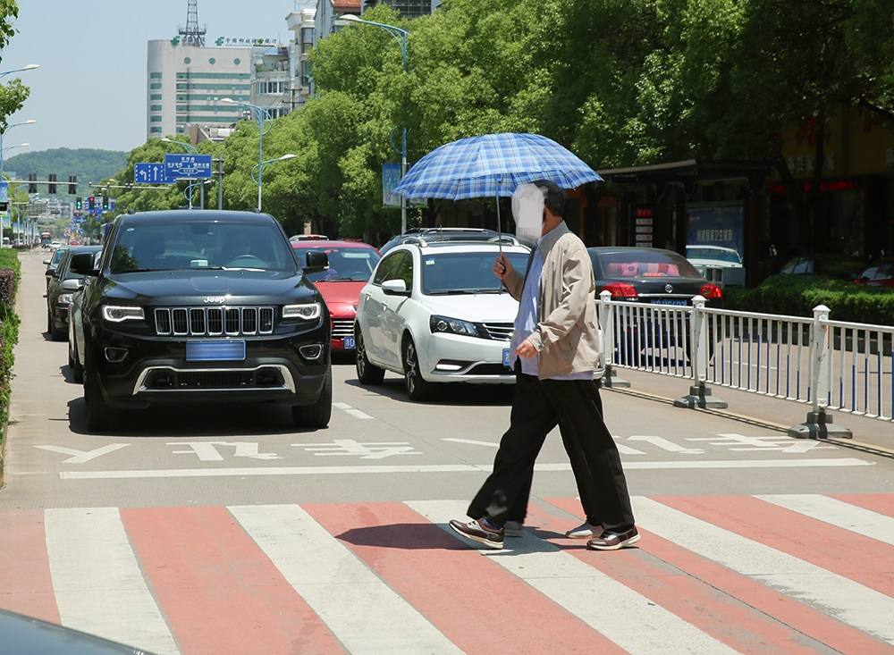

---
base_model:
- openbmb/MiniCPM-V-2_6
tags:
- rknn
- rkllm
---
# MiniCPM-V-2_6-rkllm

## (English README see below)

在RK3588上运行强大的MiniCPM-V-2.6 视觉大模型!

- 推理速度(RK3588): 视觉编码器 4.8s(单核) + LLM 填充 2.2s (92 tokens / 42.5 tps) + 解码 3.25 tps
- 内存占用(RK3588, 默认上下文长度): 视觉编码器 1.9GB + LLM 7.8GB = 9.7GB

## 使用方法

1. 克隆或者下载此仓库到本地. 模型较大, 请确保有足够的磁盘空间.
   
2. 开发板的RKNPU2内核驱动版本必须>=0.9.6才能运行这么大的模型. 
   使用root权限运行以下命令检查驱动版本:
   ```bash
   > cat /sys/kernel/debug/rknpu/version 
   RKNPU driver: v0.9.8
   ```
   如果版本过低, 请更新驱动. 你可能需要更新内核, 或查找官方文档以获取帮助.
   
3. 安装依赖

```bash
pip install numpy<2 opencv-python 
```
你还需要手动安装rknn-toolkit2-lite2. 

4. 运行
   
```bash
python multiprocess_inference.py
```

test.jpg:


>```
>Start loading language model (size: 7810.02 MB)
>
>I rkllm: rkllm-runtime version: 1.1.2, rknpu driver version: 0.9.8, platform: RK3588
>
>W rknn-toolkit-lite2 version: 2.2.0
>Start loading vision encoder model (size: 942.29 MB)
>Vision encoder loaded in 10.22 seconds
>I RKNN: [02:28:20.939] RKNN Runtime Information, librknnrt version: 2.1.0 (967d001cc8@2024-08-07T19:28:19)
>I RKNN: [02:28:20.939] RKNN Driver Information, version: 0.9.8
>I RKNN: [02:28:20.940] RKNN Model Information, version: 6, toolkit version: 2.2.0(compiler version: 2.2.0 (c195366594@2024-09-14T12:24:14)), target: RKNPU v2, target platform: rk3588, framework name: ONNX, framework layout: NCHW, model inference type: dynamic_shape
>W RKNN: [02:28:20.940] RKNN Model version: 2.2.0 not match with rknn runtime version: 2.1.0
>Received ready signal: vision_ready
>Language model loaded in 29.21 seconds
>Received ready signal: llm_ready
>All models loaded, starting interactive mode...
>
>Enter your input (3 empty lines to start inference, Ctrl+C to exit, for example: 
>详细描述一下{{./test.jpg}}这张图片
>What is the weather in {{./test.jpg}}?
>How many people are in {{./test.jpg}}?
>):
>
>以猫猫的身份描述一下{{test.jpg}}吧喵~
>
>
>
>Start vision inference...
>
>Vision encoder inference time: 4.92 seconds
>
>Time to first token: 1.95 seconds
>
>哇哦！这只像人一样的猫咪似乎正自信地走在街道上，手拿一把蓝白相间的伞。它穿着一件漂亮的外套和裤子，还有一双时尚的鞋子呢！
>
>周围的环境也很热闹啊～路上停满了各种各样的汽车、卡车和公交车，还有红绿灯在指挥交通。猫猫身边还有一个栏杆，上面挂着几面旗帜，看起来好有趣。
>
>天空一片蔚蓝，阳光明媚，猫猫似乎正在享受这美好的一天！喵呜~
>
>(finished)
>
>--------------------------------------------------------------------------------------
> Stage         Total Time (ms)  Tokens    Time per Token (ms)      Tokens per Second       
>--------------------------------------------------------------------------------------
> Prefill       1761.10          94        18.74                    53.38                   
> Generate      25757.53         104       248.72                   4.02                    
>--------------------------------------------------------------------------------------
>```

## 模型转换

#### 准备工作

1. 安装rknn-toolkit2 v2.1.0或更高版本, 以及rkllm-toolkit v1.1.2或更高版本.
2. 下载此仓库到本地, 但不需要下载`.rkllm`和`.rknn`结尾的模型文件.
3. 下载MiniCPM-V-2.6的huggingface模型仓库到本地. (https://huggingface.co/openbmb/MiniCPM-V-2_6)
  
#### 转换LLM

1. 将此仓库中的`rename_tensors.py`文件复制到MiniCPM-V-2.6的huggingface模型仓库根目录并运行. 稍等片刻, 会生成`model-renamed-00001-of-00004.safetensors`等4个safetensors文件和一个json文件.
2. 不用管那个json文件, 将那4个safetensors文件移动到此仓库根目录下.
3. 执行`rkllm-convert.py`. 等一会, 会生成`qwen.rkllm`, 就是转换后的模型.

#### 转换视觉编码器

1. 将此仓库中的`patched_modeling_navit_siglip.py`和`patched_resampler.py`复制到MiniCPM-V-2.6的huggingface模型仓库根目录下, 重命名为`modeling_navit_siglip.py`和`resampler.py`, 替换掉原来的文件.

2. 打开`vision_export_onnx.py`, 修改其中的`MODEL_PATH`为MiniCPM-V-2.6模型文件夹的路径. 然后执行. 等一会, 会生成`vision_encoder.onnx`.
3. 执行`vision_convert_rknn.py`. 等一会, 会生成`vision_encoder.rknn`, 这就是转换后的视觉编码器.

## 已知问题

- ~~由于疑似RKLLM中存在的问题, 目前此模型无法正常推理.~~ (已修复)
- ~~由于RKLLM中存在的问题, 目前视觉编码器和LLM无法同时被加载, 必须先卸载掉视觉编码器, 再重新加载LLM. 如果要推理多次, 必须重复执行卸载和加载操作, 速度非常慢.~~ (已修复)
- 由于疑似RKLLM中存在的问题, 如果视觉编码器和LLM加载进同一个Python进程, 会导致LLM推理时报错段错误. 可以使用多进程来解决. 参考`multiprocess_inference.py`.
- 由于RKLLM的多模态输入的限制, 在整个对话中只能加载一张图片. 可以通过Embedding输入的方式来解决, 但我没有实现.
- 没有实现多轮对话.
- RKLLM的w8a8量化貌似存在不小的精度损失.
- 视觉编码器转换ONNX的代码取自 https://github.com/sophgo/LLM-TPU/tree/main/models/MiniCPM-V-2_6 , 感谢Sophgo提供的代码. 但是这个转换方法似乎将原模型中的自适应图像分块算法删除了, 可能会导致精度下降.

## 参考

- [sophgo/LLM-TPU models/MiniCPM-V-2_6](https://github.com/sophgo/LLM-TPU/tree/main/models/MiniCPM-V-2_6)
- [openbmb/MiniCPM-V-2_6](https://huggingface.co/openbmb/MiniCPM-V-2_6)
- [Qwen/Qwen2-7B](https://huggingface.co/Qwen/Qwen2-7B)


## English README

Run the Powerful MiniCPM-V-2.6 Visual Language Model on RK3588!

- Inference speed (RK3588): Visual encoder 4.8s (single core) + LLM filling 2.2s (92 tokens / 42.5 tps) + decoding 3.25 tps
- Memory usage (RK3588, default context length): Visual encoder 1.9GB + LLM 7.8GB = 9.7GB

## Usage

1. Clone or download this repository locally. The model is large, so make sure you have enough disk space.
   
2. The RKNPU2 kernel driver version on the development board must be >=0.9.6 to run such a large model. 
   Use the following command with root privileges to check the driver version:
   ```bash
   > cat /sys/kernel/debug/rknpu/version 
   RKNPU driver: v0.9.8
   ```
   If the version is too low, please update the driver. You may need to update the kernel or refer to official documentation for help.
   
3. Install dependencies

```bash
pip install numpy<2 opencv-python 
```
You also need to manually install rknn-toolkit2-lite2.

4. Run
   
```bash
python multiprocess_inference.py
```

test.jpg:


>```
>Start loading language model (size: 7810.02 MB)
>
>I rkllm: rkllm-runtime version: 1.1.2, rknpu driver version: 0.9.8, platform: RK3588
>
>W rknn-toolkit-lite2 version: 2.2.0
>Start loading vision encoder model (size: 942.29 MB)
>Vision encoder loaded in 10.22 seconds
>I RKNN: [02:28:20.939] RKNN Runtime Information, librknnrt version: 2.1.0 (967d001cc8@2024-08-07T19:28:19)
>I RKNN: [02:28:20.939] RKNN Driver Information, version: 0.9.8
>I RKNN: [02:28:20.940] RKNN Model Information, version: 6, toolkit version: 2.2.0(compiler version: 2.2.0 (c195366594@2024-09-14T12:24:14)), target: RKNPU v2, target platform: rk3588, framework name: ONNX, framework layout: NCHW, model inference type: dynamic_shape
>W RKNN: [02:28:20.940] RKNN Model version: 2.2.0 not match with rknn runtime version: 2.1.0
>Received ready signal: vision_ready
>Language model loaded in 29.21 seconds
>Received ready signal: llm_ready
>All models loaded, starting interactive mode...
>
>Enter your input (3 empty lines to start inference, Ctrl+C to exit, for example: 
>详细描述一下{{./test.jpg}}这张图片
>What is the weather in {{./test.jpg}}?
>How many people are in {{./test.jpg}}?
>):
>
>Describe the image: {{test.jpg}} in every detail.
>
>
>
>Start vision inference...
>
>Vision encoder inference time: 4.80 seconds
>
>In this urban street scene, an older individual is seen crossing at a pedestrian crosswalk with an umbrella held aloft against what appears to be bright sunlight. The person's attire suggests preparedness for varying weather conditions - they're dressed casually yet practically, wearing trousers and sneakers paired with a jacket that can offer some protection from sun or light rain.
>  
>The vehicles on the road hint at a typical busy day in this locale; there are various models visible including what looks like an SUV. The presence of multiple lanes suggests traffic is managed for different types of vehicular movement - possibly separate lines for cars and larger trucks, ensuring safety for all commuters.
>
>In contrast to the hustle and bustle on the road, trees line one side of the street, providing a touch of nature amidst urban development. Their green foliage might offer shade during hotter times of the day or act as windbreakers in windy conditions.
>
>Traffic signs are visible above, which likely provide essential directions for both drivers and pedestrians alike, contributing to organized movement within this bustling environment. The presence of these elements collectively paints a picture of an orderly city where nature coexists with human-made structures, while people navigate their way through daily life amidst the backdrop of urban infrastructure.
>
>(finished)
>
>--------------------------------------------------------------------------------------
> Stage         Total Time (ms)  Tokens    Time per Token (ms)      Tokens per Second       
>--------------------------------------------------------------------------------------
> Prefill       1712.87          94        18.22                    54.88                   
> Generate      60417.39         243       249.58                   4.01                    
>--------------------------------------------------------------------------------------
>```

## Model Conversion

#### Preparation

1. Install rknn-toolkit2 v2.1.0 or higher, and rkllm-toolkit v1.1.2 or higher.
2. Download this repository locally, but you don't need to download the model files ending with `.rkllm` and `.rknn`.
3. Download the MiniCPM-V-2.6 Hugging Face model repository locally. (https://huggingface.co/openbmb/MiniCPM-V-2_6)
  
#### Converting LLM

1. Copy the `rename_tensors.py` file from this repository to the root directory of the MiniCPM-V-2.6 Hugging Face model repository and run it. Wait for a moment, it will generate 4 safetensors files like `model-renamed-00001-of-00004.safetensors` and a json file.
2. Ignore the json file, move those 4 safetensors files to the root directory of this repository.
3. Execute `rkllm-convert.py`. After a while, it will generate `qwen.rkllm`, which is the converted model.

#### Converting Visual Encoder

1. Copy `patched_modeling_navit_siglip.py` and `patched_resampler.py` from this repository to the root directory of the MiniCPM-V-2.6 Hugging Face model repository, rename them to `modeling_navit_siglip.py` and `resampler.py`, replacing the original files.

2. Open `vision_export_onnx.py`, modify the `MODEL_PATH` to the path of the MiniCPM-V-2.6 model folder. Then execute it. After a while, it will generate `vision_encoder.onnx`.
3. Execute `vision_convert_rknn.py`. After a while, it will generate `vision_encoder.rknn`, which is the converted visual encoder.

## Known Issues

- ~~Due to a suspected issue in RKLLM, this model currently cannot perform inference normally.~~ (Fixed)
- ~~Due to an issue in RKLLM, the visual encoder and LLM cannot be loaded simultaneously at present. The visual encoder must be unloaded first, then the LLM reloaded. If multiple inferences are required, the unloading and loading operations must be repeated, which is very slow.~~ (Fixed)
- Due to a suspected issue in RKLLM, if the visual encoder and LLM are loaded into the same Python process, the LLM inference will segmentation fault. You can use multiprocessing to solve this problem. See `multiprocess_inference.py`.
- Due to the limitation of RKLLM's multimodal input, only one image can be loaded in the entire conversation. This can be solved by using embedding input, but I haven't implemented it yet.
- I don't implement multi-turn chat.
- There is a significant precision loss in RKLLM's w8a8 quantization.
- The code for converting the visual encoder to ONNX is taken from https://github.com/sophgo/LLM-TPU/tree/main/models/MiniCPM-V-2_6, thanks to Sophgo for providing the code. However, this conversion method seems to have removed the adaptive image partitioning algorithm from the original model, which may lead to a decrease in accuracy.

## References

- [sophgo/LLM-TPU models/MiniCPM-V-2_6](https://github.com/sophgo/LLM-TPU/tree/main/models/MiniCPM-V-2_6)
- [openbmb/MiniCPM-V-2_6](https://huggingface.co/openbmb/MiniCPM-V-2_6)
- [Qwen/Qwen2-7B](https://huggingface.co/Qwen/Qwen2-7B)